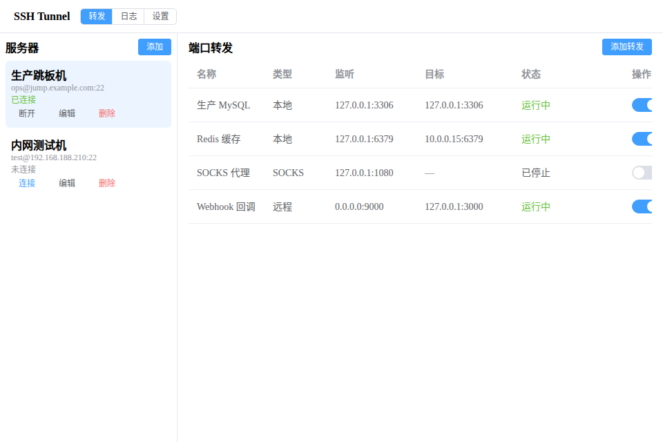
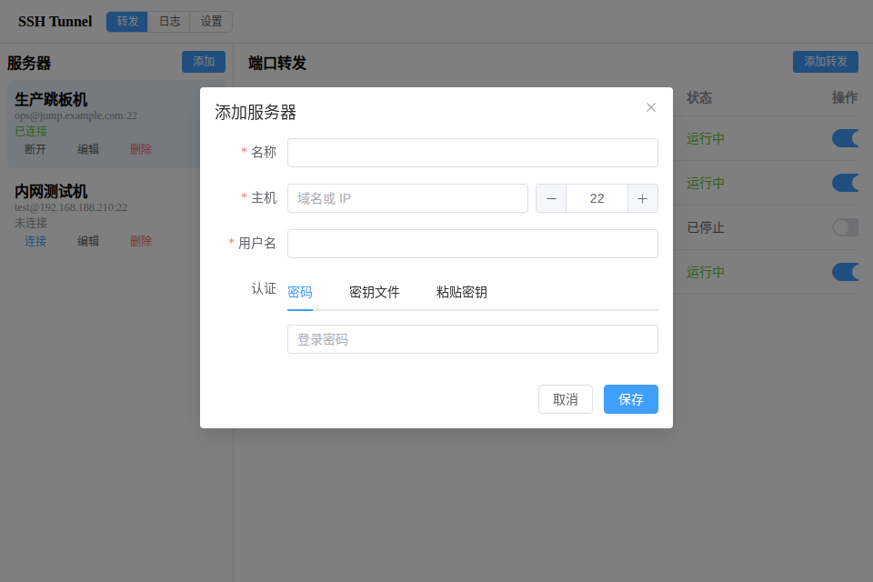
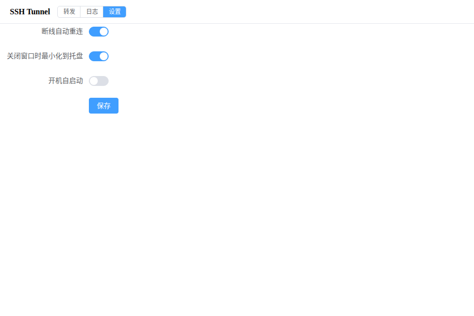
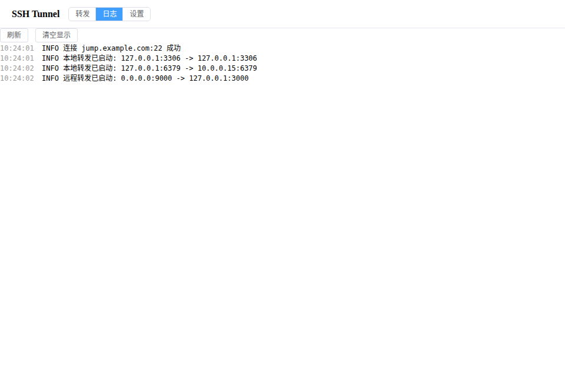

# SSH Tunnel

[English](README_EN.md)

跨平台的 SSH 端口转发桌面工具。图形化管理 SSH 隧道,本地 / 远程 / SOCKS5 三种转发,常驻系统托盘,凭据交给系统钥匙串保管。



## 功能

- **三种转发**:本地转发 `-L`、远程转发 `-R`、动态转发 `-D`(SOCKS5 代理)
- **多种认证**:密码、私钥文件(支持 `~` 路径与文件选择框)、粘贴私钥内容
- **凭据安全**:密码与 passphrase 存系统钥匙串(Windows 凭据管理器 / macOS 钥匙串 / Linux Secret Service),粘贴的私钥单独存文件(0600 权限),配置里不落任何明文敏感值
- **主机密钥校验**:首次连接弹指纹确认,密钥变更醒目警告,防中间人
- **断线自动重连**:指数退避(1s→30s 封顶),重连后自动恢复远程转发
- **系统托盘**:关窗口最小化到托盘,托盘菜单直接开关转发
- **开机自启 / 自动开启转发**:常用隧道随系统拉起
- **内置日志面板**:连接与转发事件实时可查

## 安装

从 [Releases](https://github.com/easyai-page/ssh-tunnel/releases) 下载对应平台的安装包:

| 平台 | 文件 |
| --- | --- |
| Windows | `*_x64-setup.exe`(中文安装界面)/ `*_arm64-setup.exe` |
| macOS | `*_x64.dmg`(Intel)/ `*_aarch64.dmg`(Apple Silicon) |
| Linux | `.deb` / `.rpm` / `.AppImage` |

## 使用

1. **添加服务器**:填主机、用户名,选认证方式。密码/私钥保存进系统钥匙串或独立文件,配置文件里只有主机信息

   

2. **添加转发**:选类型,填监听与目标地址,保存后点开关即可启停
3. **托盘常驻**:关闭主窗口不退出,托盘菜单可快速开关转发、打开主界面

设置页提供断线自动重连、最小化到托盘、开机自启动开关;日志页实时显示连接事件:




## 技术栈

- **壳**:Tauri 2(系统托盘、原生安装包、开机自启、文件对话框)
- **前端**:Vue 3 + Element Plus + Pinia + Vite
- **核心**(`core/` 纯 Rust 库,不依赖 Tauri):russh(SSH 协议)、tokio(每服务器一个 actor 管理连接生命周期)、keyring(系统钥匙串)

## 开发

```bash
pnpm install
pnpm tauri dev        # 桌面应用开发模式(热重载)
pnpm dev              # 仅前端,浏览器打开自动用演示 mock 数据
pnpm test             # 前端测试
cargo test            # Rust core 测试
```

## 发布

推送 `v*` 标签触发 GitHub Actions,自动构建六个平台安装包并创建 Release。

## License

Apache-2.0
